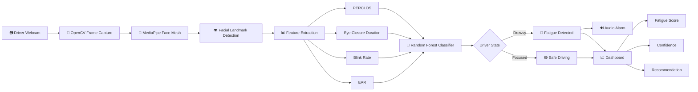

<div align="center">

# 🚗 DriverGuard AI

### Real-Time Driver Fatigue Detection System using Computer Vision & Machine Learning

Detects driver drowsiness in real-time using eye movement analysis, facial landmarks, and Machine Learning.


</div>

---

## 📌 Abstract

Driver fatigue is one of the major causes of road accidents worldwide. Fatigued drivers often experience slower reaction times, reduced attention, and impaired decision-making.

DriverGuard AI addresses this problem through a low-cost, camera-based solution that uses Computer Vision and Machine Learning to detect fatigue-related eye behavior.

The system continuously analyzes:

- Eye Aspect Ratio (EAR)
- Blink Rate
- Eye Closure Duration
- PERCLOS

These features are processed by a trained Random Forest model to classify the driver as:

🟢 **Focused**

or

🔴 **Drowsy**

When drowsiness is detected, the system triggers an audio alarm and displays real-time fatigue metrics on an interactive dashboard.

---

# 🎯 Problem Statement

Driver drowsiness is a significant contributor to road accidents and fatalities worldwide.

### Challenges

- Fatigue symptoms often go unnoticed by drivers.
- Driver alertness continuously decreases during long journeys.
- Commercial fatigue monitoring systems are expensive.
- Many existing solutions require dedicated sensors and specialized hardware.

### Objective

Develop a low-cost, real-time fatigue detection system capable of:

- Monitoring driver alertness continuously
- Detecting signs of drowsiness early
- Providing immediate warnings
- Improving overall road safety

---

# 💡 Proposed Solution

DriverGuard AI uses a standard webcam and AI-powered analysis to monitor driver fatigue in real time.

### Core Functionality

1. Capture live video from webcam.
2. Detect facial landmarks using MediaPipe Face Mesh.
3. Extract eye-related fatigue parameters.
4. Compute fatigue indicators.
5. Predict driver condition using Machine Learning.
6. Trigger alarm when drowsiness is detected.
7. Display results on a real-time dashboard.

---

## ✨ Features

✅ Real-Time Webcam Monitoring

✅ Facial Landmark Detection

✅ Eye Aspect Ratio (EAR) Calculation

✅ Blink Rate Analysis

✅ Eye Closure Duration Monitoring

✅ PERCLOS Calculation

✅ Random Forest Prediction Model

✅ Audio Alarm System

✅ Fatigue Score Generation

✅ Confidence Score

✅ Driver Recommendation System

✅ Interactive Streamlit Dashboard

---
# 🏗️ DriverGuard AI Architecture



# 🧠 Fatigue Parameters

## 1️⃣ Eye Aspect Ratio (EAR)

EAR measures how open or closed the eye is.

### Formula

```text
EAR = (A + B) / (2 × C)
```

Where:

- A = First vertical eye distance
- B = Second vertical eye distance
- C = Horizontal eye distance

### Interpretation

| EAR Value | State |
|------------|--------|
| > 0.20 | Eye Open |
| < 0.20 | Eye Closed |

---

## 2️⃣ Blink Rate

Measures the number of blinks per minute.

```text
Blink Rate = Total Blinks / Time
```

Higher blink frequency can indicate fatigue.

---

## 3️⃣ Eye Closure Duration

Measures how long the eyes remain continuously closed.

```text
Closure Duration =
Current Time - Eye Closed Start Time
```

Longer durations indicate increased drowsiness.

---

## 4️⃣ PERCLOS

Percentage of Eye Closure.

```text
PERCLOS =
(Closed Eye Frames / Total Frames)
× 100
```

PERCLOS is one of the most widely accepted indicators of driver fatigue.

---

# 🤖 Machine Learning Model

## Algorithm Used

Random Forest Classifier

### Input Features

- Eye Aspect Ratio (EAR)
- Blink Rate
- Eye Closure Duration
- PERCLOS

### Output Classes

| Class | Meaning |
|---------|----------|
| 0 | Focused |
| 1 | Drowsy |

### Model Storage

```text
models/
└── fatigue_model.pkl
```

Stored using Joblib for efficient deployment.

# 🛠️ Technology Stack

<p align="center">


</p>

# 📂 Project Structure

```text
DriverGuardAI/
│
├── app.py
│
├── models/
│   └── fatigue_model.pkl
│
├── assets/
│   └── alarm.wav
│
├── src/
│   ├── utils.py
│   └── alarm.py
│
├── requirements.txt
│
└── README.md
```

---

# ⚙️ Installation Guide

## Step 1: Install Python 3.11

Download Python 3.11:

https://www.python.org/downloads/release/python-3110/

Verify installation:

```bash
python --version
```

Expected Output:

```text
Python 3.11.x
```

---
## Step 2: Install Microsoft C++ Build Tools (Required)

Some dependencies (such as `simpleaudio`) may require Microsoft Visual C++ Build Tools during installation.

### Download

🔗 https://visualstudio.microsoft.com/visual-cpp-build-tools/

### Installation Steps

1. Open the download link.
2. Download **Build Tools for Visual Studio**.
3. Launch the installer.
4. Select:

✅ **Desktop development with C++**

5. In the Installation Details panel, ensure these components are selected:

- MSVC v143 - VS 2022 C++ x64/x86 build tools
- Windows 10 SDK (or Windows 11 SDK)
- C++ CMake tools for Windows

6. Click **Install**.
7. Restart your system after installation completes.

### Verify Installation

Open Command Prompt and run:

```bash
cl
```

If installed correctly, you should see output similar to:

```text
Microsoft (R) C/C++ Optimizing Compiler
Version 19.xx.xxxxx for x64
```

### Why is this required?

Certain Python packages contain native C/C++ extensions that must be compiled during installation.

Without Build Tools, you may encounter errors such as:

```text
error: Microsoft Visual C++ 14.0 or greater is required
```

Installing the Build Tools resolves this issue.

## Step 3: Clone Repository

```bash
git clone <repository-url>
```

```bash
cd DriverGuardAI
```

---

## Step 4: Create Virtual Environment

```bash
python -m venv venv
```

Activate Environment:

### Windows

```bash
venv\Scripts\activate
```

### Linux / MacOS

```bash
source venv/bin/activate
```

---

## Step 5: Install Dependencies

```bash
pip install -r requirements.txt
```

---

## Step 6: Run Application

```bash
streamlit run app.py
```

---

# 🔊 Alarm System

When the model predicts:

```text
DROWSY
```

The system:

- Activates an audio alarm
- Continuously warns the driver
- Stops automatically when the driver returns to a focused state

---

# 📊 Dashboard Metrics

The dashboard displays:

### Driver Status

🟢 Focused

🔴 Drowsy

---

### Fatigue Score

```text
0% → Fully Alert
100% → Highly Fatigued
```

---

### Confidence Score

Prediction confidence produced by the model.

---

### EAR

Measures eye openness.

---

### Blink Rate

Number of blinks per minute.

---

### Eye Closure Duration

Continuous duration of eye closure.

---

### PERCLOS

Percentage of time eyes remain closed.

---

# 📈 Results

### Successfully Implemented

✅ Face Detection

✅ Facial Landmark Tracking

✅ EAR Calculation

✅ Blink Detection

✅ Eye Closure Monitoring

✅ PERCLOS Calculation

✅ Random Forest Classification

✅ Audio Alert System

✅ Real-Time Dashboard

### Outcome

The system successfully detects fatigue-related eye behavior and provides visual and audio alerts to improve driver safety.

---

# 🚀 Future Scope

- Yawn Detection
- Head Pose Estimation
- Mobile Application
- Cloud Deployment
- Hardware Optimization
- LSTM-Based Temporal Analysis
- Fleet Monitoring Dashboard
- GPS-Based Emergency Alerts
- Night-Time Driver Monitoring

---

# 👨‍💻 Team Members

- Lavanya Bani
- Aafreen
- Warisha
- Sukriti

---

# 🎓 Project Guide

Dr. Aniket Dixit

---

<div align="center">

## 🚗 DriverGuard AI

### Real-Time Driver Fatigue Detection System

Built using Python, OpenCV, MediaPipe and Machine Learning

**Safe Driving Saves Lives**

</div>
